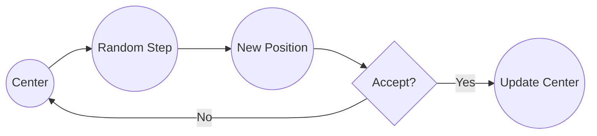
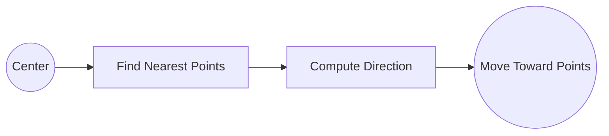

# Core Concepts

Understanding the fundamental concepts behind kmeanssa-ng will help you use the library effectively and extend it for your own research.

## What are Quantum Graphs?

A **quantum graph** is a metric graph where:

- **Nodes** are connected by **edges** with positive lengths
- **Points** can exist anywhere on edges, not just at nodes  
- **Distance** is measured along the graph (geodesic distance)

```python
from kmeanssa_ng import QuantumGraph, QGPoint

# Create a simple triangle graph
graph = QuantumGraph()
graph.add_edge(0, 1, length=1.0)
graph.add_edge(1, 2, length=1.5) 
graph.add_edge(2, 0, length=2.0)

# Points can be anywhere on edges
point_a = QGPoint(graph, edge=(0, 1), position=0.3)  # 30% along edge (0,1)
point_b = QGPoint(graph, edge=(1, 2), position=0.8)  # 80% along edge (1,2)

# Distance is measured along the graph
distance = graph.distance(point_a, point_b)
```

### Why Quantum Graphs?

Traditional clustering algorithms assume points live in Euclidean spaces (like 2D or 3D). But many real-world scenarios involve:

- **Road networks** - GPS coordinates along roads
- **Neural networks** - Signals propagating along connections  
- **Social networks** - Information spreading through connections
- **River networks** - Pollution or species distribution along waterways

## Simulated Annealing for K-means

The core algorithm combines two processes:

### 1. Brownian Motion (Exploration)

Centers perform random walks to explore the space:



**Purpose**: Avoid getting stuck in local minima by exploring widely.

### 2. Drift (Exploitation)  

Centers move toward their nearest data points:



**Purpose**: Refine center positions based on actual data.

### Temperature Control

The balance between exploration and exploitation is controlled by **temperature**:

- **High temperature** → More Brownian motion (exploration)
- **Low temperature** → More drift (exploitation)

Temperature decreases over time using an **inhomogeneous Poisson process**.

## Algorithm Variants

### Version 1 (v1) - Interleaved
```python
for each_iteration:
    brownian_motion()  # Explore
    drift_step()       # Exploit
```

### Version 2 (v2) - Sequential  
```python
for first_half_iterations:
    brownian_motion()  # Pure exploration

for second_half_iterations:
    drift_step()       # Pure exploitation
```

Choose based on your problem:
- **v1**: Balanced for most cases
- **v2**: Better when you need distinct exploration/exploitation phases

## Robustification

Instead of using just the final result, kmeanssa-ng averages the last few iterations:

```python
# Use last 10% of iterations for final result
centers = sa.run(robust_prop=0.1)
```

**Benefits**:
- Reduces sensitivity to random fluctuations
- More stable and reproducible results
- Better convergence in noisy scenarios

## Key Parameters

### Algorithm Parameters

- **`k`**: Number of clusters (like standard k-means)
- **`lambda_param`**: Temperature parameter (higher = more exploration)
- **`beta`**: Drift strength (higher = stronger attraction to data)  
- **`step_size`**: Random walk step size

### Tuning Guidelines

```python
# Conservative (more exploration)
sa = SimulatedAnnealing(points, k=3, lambda_param=2, beta=0.5)

# Aggressive (more exploitation)
sa = SimulatedAnnealing(points, k=3, lambda_param=0.5, beta=2)

# Fine-grained (smaller steps)
sa = SimulatedAnnealing(points, k=3, step_size=0.05)
```

## Initialization Strategies

### Random Initialization
```python
centers = sa.run(initialization="random")
```

### k-means++ Initialization (Recommended)
```python
centers = sa.run(initialization="kpp")
```

k-means++ spreads initial centers apart, leading to:
- Faster convergence
- Better final results
- More consistent outcomes

## Distance Computation

Quantum graphs use **geodesic distance** - the shortest path along the graph:

```python
# Between two points on the same edge
distance = |position_1 - position_2| * edge_length

# Between points on different edges  
distance = distance_to_node + shortest_path + distance_from_node
```

**Performance tip**: Always call `graph.precomputing()` to cache shortest paths between all node pairs.

## Extending to New Spaces

The three-layer architecture makes it easy to add new metric spaces:

```python
from kmeanssa_ng.core import Space, Point, Center

class MySpace(Space):
    def distance(self, p1: Point, p2: Point) -> float:
        # Implement your distance function
        pass
    
    def sample_points(self, n: int) -> list[Point]:
        # Implement point sampling  
        pass
    
    # ... implement other required methods

# Use the same SimulatedAnnealing algorithm
sa = SimulatedAnnealing(my_points, k=3)
centers = sa.run()
```

## Next Steps

- **[Quantum Graphs Guide](../user-guide/quantum-graphs.md)** - Deep dive into quantum graph features
- **[Simulated Annealing Guide](../user-guide/simulated-annealing.md)** - Algorithm details and tuning
- **[Custom Spaces Guide](../user-guide/custom-spaces.md)** - Implement your own metric spaces