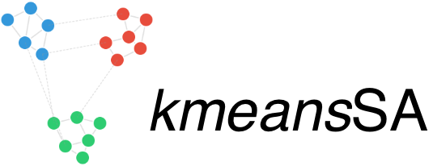

# Home

This package provides an implementation of the k-means clustering
algorithm using simulated annealing. It is designed to work on various
types of spaces, with an initial focus on metric graphs. Future
developments will include support for Riemannian manifolds. The core
goal of this library is to offer a framework that allows users to easily
define and work with their own custom spaces, provided they can define a
notion of a Brownian motion and a drift within that space.

## Next Steps

- **[Quickstart](quickstart.md)**: To install the package and see a
  first example.
- **[Concepts](concepts.md)**: To understand the theory and the core
  features.
- **[Examples](basic-clustering.md)**: To explore more advanced use
  cases.

## License

This project is licensed under the [MIT
License](https://opensource.org/licenses/MIT).  © Copyright 2025,
Nicolas Klutchnikoff and Ioana Gavra
