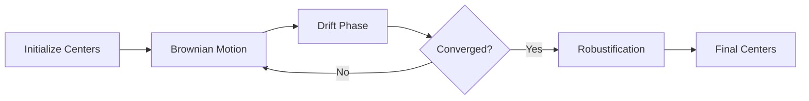
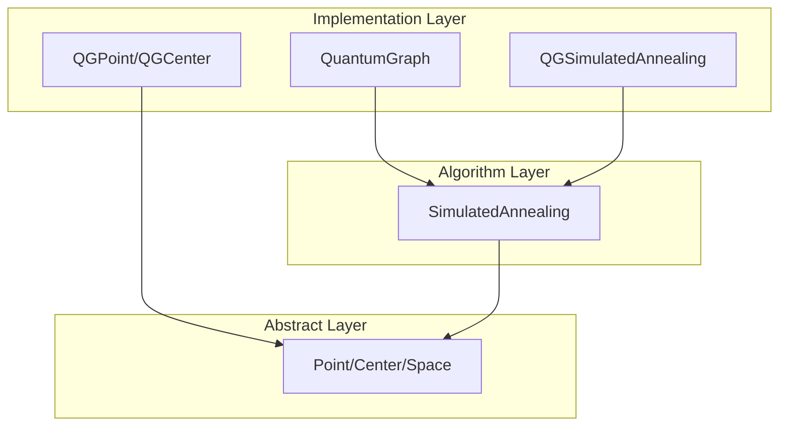

# kmeanssa-ng

[](https://opensource.org/licenses/MIT)
[](https://www.python.org/downloads/)
[](https://plmlab.math.cnrs.fr/nicolas.klutchnikoff/kmeanssa-ng/-/pipelines)
[](https://plmlab.math.cnrs.fr/nicolas.klutchnikoff/kmeanssa-ng/-/commits/main)
[](https://github.com/astral-sh/ruff)

**K-means clustering on quantum graphs and metric spaces using simulated annealing**

`kmeanssa-ng` is a modern Python package for solving the k-means problem on arbitrary metric spaces, with a focus on **quantum graphs** — metric graphs where points can lie anywhere on edges, not just at nodes.

## Key Features

!!! tip "What makes kmeanssa-ng special?"

    - **🌐 Quantum Graph Support**: Full clustering on quantum graphs with points anywhere on edges
    - **🔥 Simulated Annealing**: Robust k-means combining Brownian motion and drift
    - **🎯 Flexible Architecture**: Extensible to any metric space via abstract base classes
    - **⚡ Smart Initialization**: k-means++ initialization for faster convergence
    - **🛡️ Robustification**: Averaging of final iterations for stable results
    - **🏗️ Graph Generators**: Pre-built generators for testing and research
    - **📝 Type Hints**: Fully typed codebase with modern Python features

## Algorithm Overview

The core algorithm alternates between two phases:



1. **Brownian Motion** (exploration): Centers perform random walks on the metric space
2. **Drift** (exploitation): Centers move toward their nearest observations  
3. **Robustification**: Averages results from final iterations for stability

Temperature is controlled by an inhomogeneous Poisson process for optimal convergence.

## Quick Example

```python
from kmeanssa_ng import generate_sbm, SimulatedAnnealing

# Create a quantum graph with 2 clusters
graph = generate_sbm(
    sizes=[50, 50],
    p=[[0.7, 0.1], [0.1, 0.7]]
)
graph.precomputing()

# Sample points and run clustering
points = graph.sample_points(100)
sa = SimulatedAnnealing(points, k=2, lambda_param=1, beta=1.0)
centers = sa.run(robust_prop=0.1, initialization="kpp")
```

## Applications

- **Network Analysis**: Clustering on social networks, transportation networks
- **Spatial Statistics**: Analysis of data distributed along networks
- **Mathematical Research**: K-means on general metric spaces
- **Graph Theory**: Community detection on metric graphs

## Getting Started

<div class="grid cards" markdown>

-   :material-rocket-launch: **[Quick Start](getting-started/quickstart.md)**

    ---

    Get up and running with your first clustering example

-   :material-book-open: **[Core Concepts](getting-started/concepts.md)**

    ---

    Understand quantum graphs and simulated annealing

-   :material-api: **[API Reference](api/core.md)**

    ---

    Detailed API documentation for all modules

-   :material-lightbulb: **[Examples](examples/basic-clustering.md)**

    ---

    Practical examples and use cases

</div>

## Architecture

The package follows a clean three-layer architecture:



This design allows easy extension to new metric spaces while maintaining algorithmic consistency.

## Citation

If you use this package in your research, please cite:

```bibtex
@software{kmeanssa_ng,
  author = {Klutchnikoff, Nicolas},
  title = {kmeanssa-ng: K-means clustering on quantum graphs},
  year = {2025},
  url = {https://plmlab.math.cnrs.fr/nicolas.klutchnikoff/kmeanssa-ng}
}
```

## License

This project is licensed under the MIT License. See the [LICENSE](https://plmlab.math.cnrs.fr/nicolas.klutchnikoff/kmeanssa-ng/-/blob/main/LICENSE) file for details.