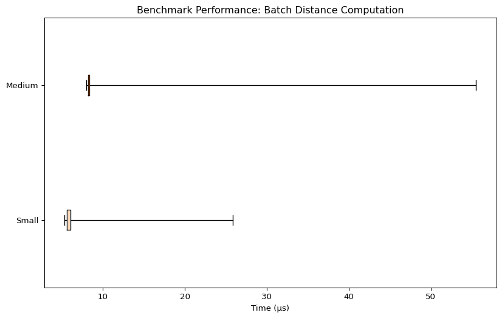
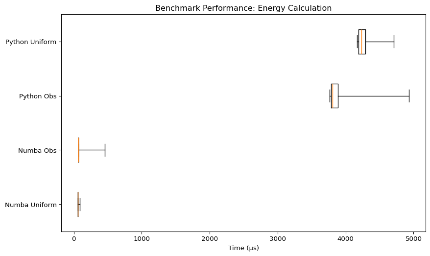
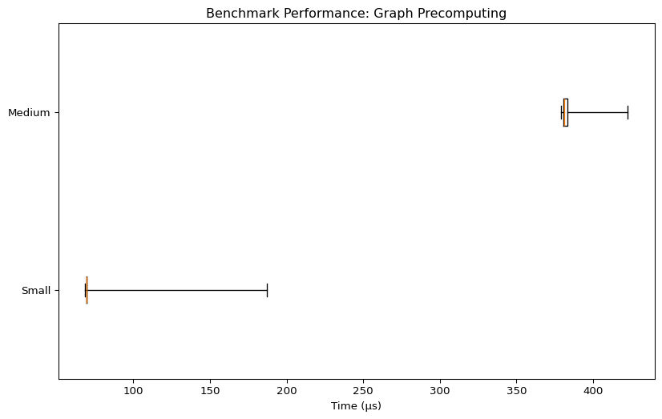
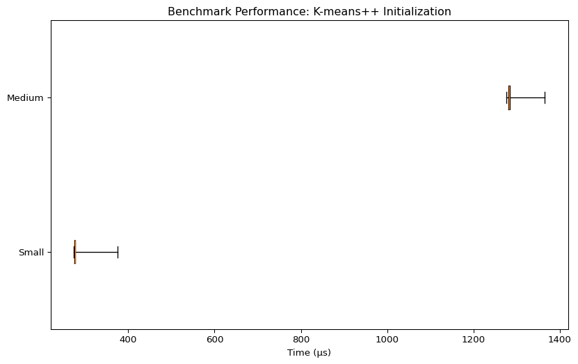
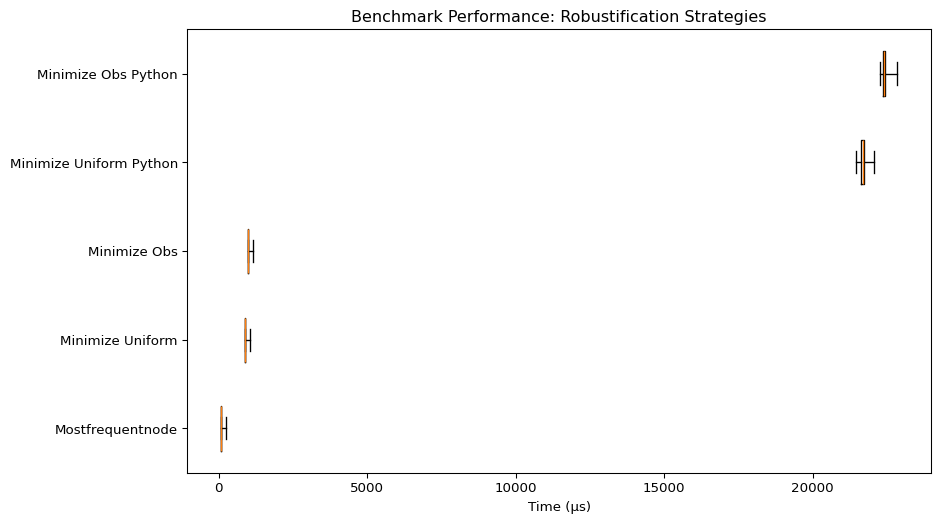
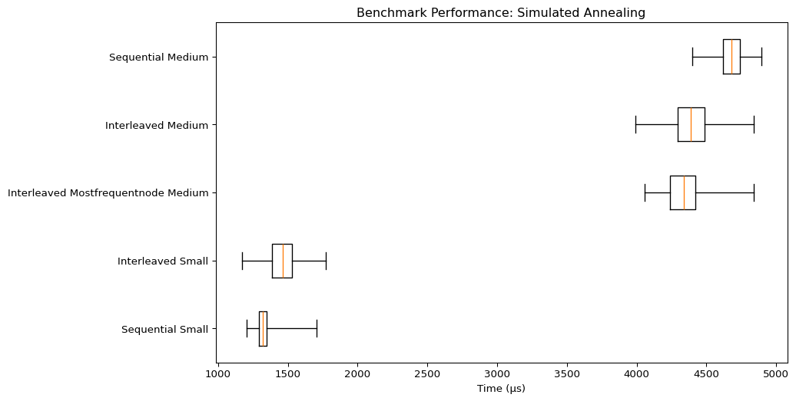

This page presents performance benchmarks for critical operations in
`kmeanssa-ng`. The generation of this document is automated and follows
these steps:

1.  **Benchmark Execution**: The performance benchmarks are executed
    using `pytest` with the `pytest-benchmark` plugin. This is done by
    running the `pdm benchmark-all` command, which saves the results in
    a JSON file.
2.  **Data Processing**: A script then processes this raw benchmark
    data, structuring it into the `docs-src/benchmark_data.json` file.
    This is handled by the `scripts/generate_benchmark_docs.py` script.
3.  **Documentation Rendering**: Finally, the Quarto document
    (`performance.qmd`) is rendered to markdown. This document reads the
    data from `benchmark_data.json` to generate the tables and plots you
    see on this page. The entire process is orchestrated by the
    `pdm makedoc` command.

*Benchmarks generated from:
0008_942b9e61fdd7a63974f0166f0dde37ea69843f39_20251028_073837_uncommited-changes.json*

## Robustification Strategies

The kmeanssa-ng library offers two main robustification strategies to
improve the position of the centers at the end of the simulated
annealing algorithm. Instead of keeping the last position of the
centers, robustification analyzes the final steps of the simulation
(e.g., the final 10%) to determine an optimal position.

Two robustification strategies are available:

- `MostFrequentNode`: This strategy selects the most frequently visited
  node (position) during the final stages of the simulated annealing as
  the final center. It is a fast and effective approach if the centers
  converge to a stable position.
- `MinimizeEnergy`: This strategy searches for the position among those
  visited during the last steps that minimizes the system’s energy. This
  approach is more computationally expensive but can lead to better
  results by identifying more energetically stable center
  configurations. The energy can be calculated in two ways: `uniform`
  (the energy is calculated with respect to a uniform distribution on
  the nodes of the Quantum Graph) and `obs` (the energy is calculated
  using an empirical distribution based only on the observations, that
  is, the data points).

To optimize performance, `MinimizeEnergy` and its core component,
`calculate_energy`, are provided in two implementations:

- Pure Python: A readable and easy-to-understand version.
- Numba: A just-in-time (JIT) compiled version that provides a
  significant speedup for the computationally heavy parts of the
  algorithm. kmeanssa-ng will automatically use the Numba version if it
  is available.

The following table compares the different robustification strategies.
`MostFrequentNode` is used as the baseline reference (1.0x).

| Strategy         | Implementation | Mode    | Mean Time   | Ratio vs. MostFrequentNode |
|:-----------------|:---------------|:--------|:------------|:---------------------------|
| MostFrequentNode | \-             | \-      | 75.53 µs    | 1.0x                       |
| MinimizeEnergy   | Numba          | uniform | 887.46 µs   | **11.75x (slower)**        |
| MinimizeEnergy   | Numba          | obs     | 991.32 µs   | **13.13x (slower)**        |
| MinimizeEnergy   | Python         | uniform | 21690.35 µs | **287.19x (slower)**       |
| MinimizeEnergy   | Python         | obs     | 22403.76 µs | **296.64x (slower)**       |

The `MinimizeEnergy` strategy is significantly slower than
`MostFrequentNode` because it relies on the `calculate_energy` function,
which is computationally intensive. While `calculate_energy` is heavily
accelerated by Numba (see table below), `MinimizeEnergy` calls it
repeatedly within a loop (15 times for a 10% robustification with 150
observations).

This overhead, combined with other non-accelerated Python operations,
dilutes the overall performance gain. The Numba-accelerated version of
`MinimizeEnergy` is still 23-24x faster than its pure Python equivalent,
but the final speedup is lower than that of `calculate_energy` alone.
This reveals an algorithmic trade-off between solution quality and
computational complexity: while `MinimizeEnergy` produces higher-quality
clusterings than `MostFrequentNode` by optimizing center selection more
thoroughly, this improvement comes at a substantial increase in
computational expense.

The following table compares the performance of pure Python vs
Numba-accelerated implementations for the `calculate_energy` function:

| Method | Mode      | Mean Time  | Speedup vs. Python |
|:-------|:----------|:-----------|:-------------------|
| Python | `uniform` | 4263.53 µs | 1.0x               |
| Numba  | `uniform` | 60.45 µs   | **70.5x**          |
| Python | `obs`     | 3866.39 µs | 1.0x               |
| Numba  | `obs`     | 71.04 µs   | **54.4x**          |

## Detailed Benchmark Data

This section provides the raw performance data for all benchmarked
operations, including mean, min, and max execution times.

### Batch Distance Computation

| Benchmark | Mean Time (µs) | Min Time (µs) | Max Time (µs) | Rounds |
|:----------|---------------:|--------------:|--------------:|-------:|
| Small     |           7.38 |          5.33 |         25.88 |     13 |
| Medium    |           8.32 |          7.96 |          55.5 |  51282 |

### Energy Calculation

| Benchmark      | Mean Time (µs) | Min Time (µs) | Max Time (µs) | Rounds |
|:---------------|---------------:|--------------:|--------------:|-------:|
| Numba Uniform  |          60.45 |         59.83 |         89.29 |  14069 |
| Numba Obs      |          71.04 |         66.37 |        460.58 |    529 |
| Python Obs     |        3866.39 |       3764.29 |       4933.58 |    257 |
| Python Uniform |        4263.53 |       4169.83 |        4707.5 |    234 |

### Graph Precomputing

| Benchmark | Mean Time (µs) | Min Time (µs) | Max Time (µs) | Rounds |
|:----------|---------------:|--------------:|--------------:|-------:|
| Small     |          70.04 |         68.67 |        187.42 |   5577 |
| Medium    |         382.28 |           379 |        422.33 |   2523 |

### K-means++ Initialization

| Benchmark | Mean Time (µs) | Min Time (µs) | Max Time (µs) | Rounds |
|:----------|---------------:|--------------:|--------------:|-------:|
| Small     |         277.47 |         274.5 |        375.75 |   1891 |
| Medium    |        1283.71 |       1276.17 |       1364.25 |    703 |

### Robustification Strategies

| Benchmark                      | Mean Time (µs) | Min Time (µs) | Max Time (µs) | Rounds |
|:-------------------------------|---------------:|--------------:|--------------:|-------:|
| Mostfrequentnode               |          75.53 |         72.67 |        240.46 |   8912 |
| Minimize Energy Uniform        |         887.46 |        877.21 |       1037.54 |   1096 |
| Minimize Energy Obs            |         991.32 |        981.08 |       1157.71 |    986 |
| Minimize Energy Uniform Python |        21690.3 |       21474.6 |       22081.1 |     46 |
| Minimize Energy Obs Python     |        22403.8 |       22251.5 |       22851.9 |     45 |

### Simulated Annealing

| Benchmark                           | Mean Time (µs) | Min Time (µs) | Max Time (µs) | Rounds |
|:------------------------------------|---------------:|--------------:|--------------:|-------:|
| Sequential Small                    |        1318.44 |       1205.63 |       1706.79 |    738 |
| Interleaved Small                   |        1461.48 |        1168.5 |       1769.21 |    299 |
| Interleaved Mostfrequentnode Medium |        4341.57 |       4055.17 |       4840.63 |    213 |
| Interleaved Medium                  |        4390.18 |       3989.96 |       4841.08 |    222 |
| Sequential Medium                   |           4681 |       4397.58 |       4893.62 |    211 |
