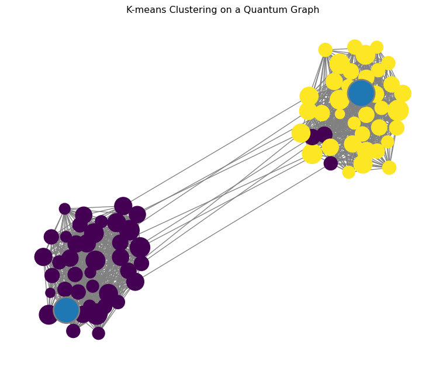

This guide provides a basic example of how to use `kmeanssa-ng` to
perform clustering on a quantum graph and visualize the results.

## 1. Generate a Sample Graph

First, we generate a stochastic block model (SBM) graph with two
distinct communities. This graph will serve as our metric space.

``` python
from kmeanssa_ng import generate_sbm

# Generate a graph with two distinct communities
graph = generate_sbm(
    sizes=[40, 40],  # Two communities of 40 nodes each
    p=[
        [0.7, 0.01],  # High intra-community connectivity
        [0.01, 0.7],
    ],  # Low inter-community connectivity
)

# Essential: precompute shortest paths
graph.precomputing()
```

## 2. Sample Points

Next, we sample data points uniformly across the graph. These are the
points we want to cluster.

``` python
# Sample points uniformly across the graph
points = graph.sample_points(500)
```

## 3. Run K-means with Simulated Annealing

Now, we run the simulated annealing algorithm to find the cluster
centers. We specify the number of clusters (`k=2`) and other parameters
for the annealing process.

``` python
from kmeanssa_ng import SimulatedAnnealing, MostFrequentNode, KMeansPlusPlus

# Run quantum graph specialized simulated annealing
sa = SimulatedAnnealing(
    observations=points,
    k=2,                  # We know there are 2 clusters
    lambda_param=1.0,     # Standard temperature
    beta=1.0,             # Standard drift strength
    step_size=0.1         # Standard step size
)

# Get cluster centers
centers = sa.run_interleaved(
    robust_prop=0.1,                                  # 10% robustness
    initialization_strategy=KMeansPlusPlus(),         # K-means++ initialization
    robustification_strategy=MostFrequentNode()       # Choose centers as most frequent nodes in clusters
)
print(f"Cluster centers: {centers}")
```

    Cluster centers: [QGCenter(edge=(23, 29), position=0.000), QGCenter(edge=(60, 69), position=0.000)]

## 4. Visualize the Results

Finally, we visualize the graph, the data points, and the resulting
cluster centers using the built-in plotting capabilities of
`kmeanssa-ng`. Note that you need to install the `plot` extras for this:
`pip install kmeanssa-ng[plot]`.

``` python
import matplotlib.pyplot as plt

# Compute cluster assignments for all nodes
graph.compute_clusters(centers)

# Visualize the graph and clusters
fig, ax = plt.subplots(figsize=(10, 8))
graph.draw(
    ax=ax,
    color_by="cluster",
    centers=centers,
    node_size_by_obs=True,  # Show which nodes have more sampled points
    edge_color="grey",
)
plt.title("K-means Clustering on a Quantum Graph")
plt.show()
```



The resulting plot will show the two communities of the graph, with the
nodes colored according to their assigned cluster and the cluster
centers highlighted.
